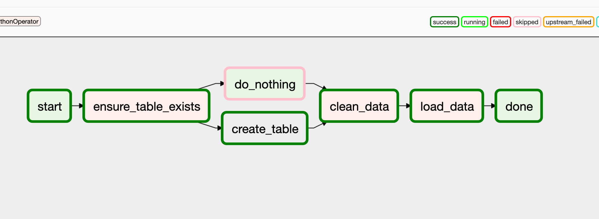
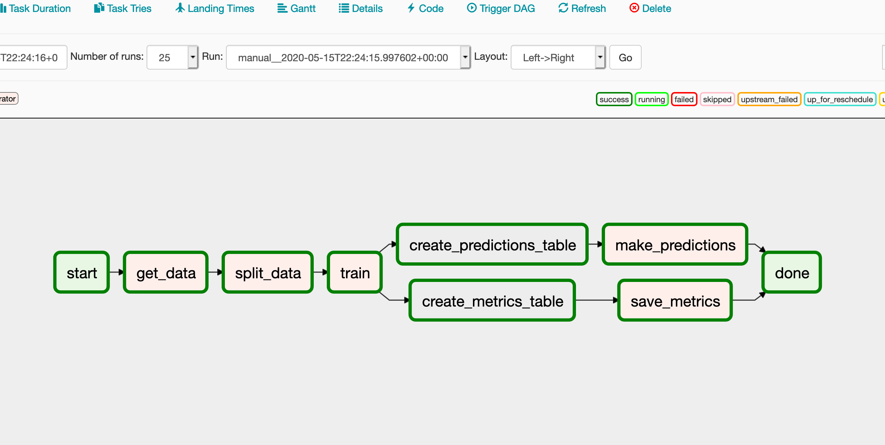

# airflow-sandbox

Simple ETL and ML pipeline with Churn data. Analysis and the model notebook can be found at https://github.com/sercandogan/churn-telco
### Build
```bash
docker-compose up
```
After building airflow and postgresql you need some configurations:

#### Create Airflow user:
```bash
usage: airflow create_user [-h] [-r ROLE] [-u USERNAME] [-e EMAIL]
                           [-f FIRSTNAME] [-l LASTNAME] [-p PASSWORD]
                           [--use_random_password]

optional arguments:
  -h, --help            show this help message and exit
  -r ROLE, --role ROLE  Role of the user. Existing roles include Admin, User,
                        Op, Viewer, and Public
  -u USERNAME, --username USERNAME
                        Username of the user
  -e EMAIL, --email EMAIL
                        Email of the user
  -f FIRSTNAME, --firstname FIRSTNAME
                        First name of the user
  -l LASTNAME, --lastname LASTNAME
                        Last name of the user
  -p PASSWORD, --password PASSWORD
                        Password of the user
  --use_random_password
                        Do not prompt for password. Use random string instead

```

#### Create data warehouse:
```bash
docker-compose exec postgres bash
```
```bash
psql -U airflow
```
```bash
 CREATE DATABASE dw OWNER airflow;
```

# Dags

## Load data


## Train and Prediction

